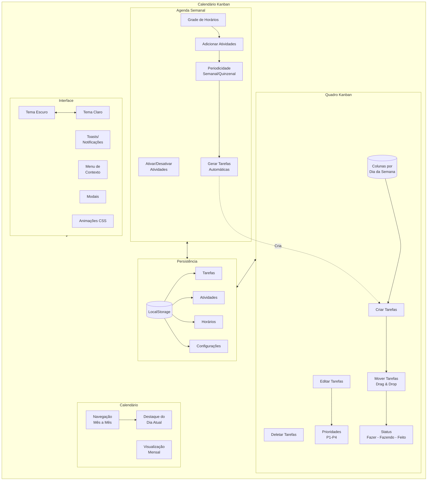
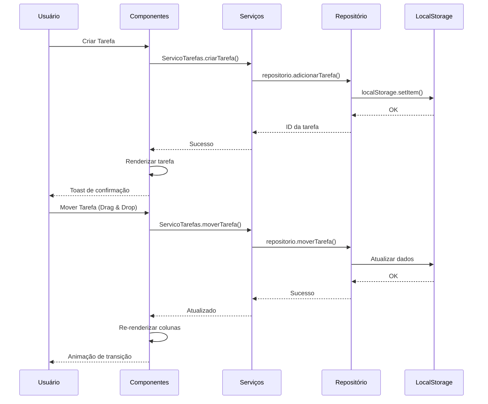
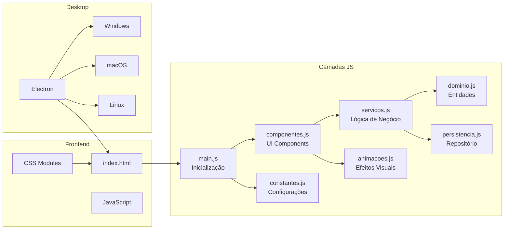

# Calendário Kanban

Aplicação de gerenciamento de tarefas com quadro Kanban e agenda semanal.

``Este aplicativo é um estudo de possibilidades.``


## Estrutura do Projeto

```
KANBAN_APP/
├── frontend/           # Interface web (HTML/CSS/JS)
│   ├── css/           # Estilos
│   ├── js/            # Lógica JavaScript
│   └── icons/         # Ícones SVG da interface
├── electron/          # Configuração do app desktop
│   └── main-electron.js
├── backend/           # Backend Python original (PyQt6)
│   ├── main.py
│   ├── componentes_ui.py
│   ├── dominio.py
│   ├── persistencia.py
│   ├── servicos.py
│   └── temas/
├── assets/            # Ícones do aplicativo
│   ├── icon.svg       # Ícone fonte
│   ├── icon.ico       # Windows
│   └── icon-*.png     # Vários tamanhos
├── docs/              # Documentação
│   ├── INSTALADOR.md  # Guia para criar instalador
│   ├── FRONTEND.md    # Documentação do frontend
│   └── README_ORIGINAL.md  # Doc original do PyQt6
└── backup/            # Backups do projeto
```

O instalador será gerado na pasta `dist/`.

## Funcionalidades

- **Quadro Kanban** - Organize tarefas por dia da semana
- **Agenda Semanal** - Visualize atividades em grade de horários
- **Calendário Mensal** - Navegue entre meses
- **Tema Claro/Escuro** - Alterne entre modos visuais
- **Persistência Local** - Dados salvos no navegador (localStorage)
- **App Desktop** - Empacotado com Electron

## Diagrama de Funcionalidades



### Fluxo de Dados



### Arquitetura de Camadas



## Tecnologias

### Frontend Web
- HTML5, CSS3, JavaScript (Vanilla)
- LocalStorage para persistência
- Animações CSS

### Desktop
- Electron 28.x
- electron-builder para empacotamento

### Backend Original
- Python 3.x
- PyQt6
- SQLite

---
